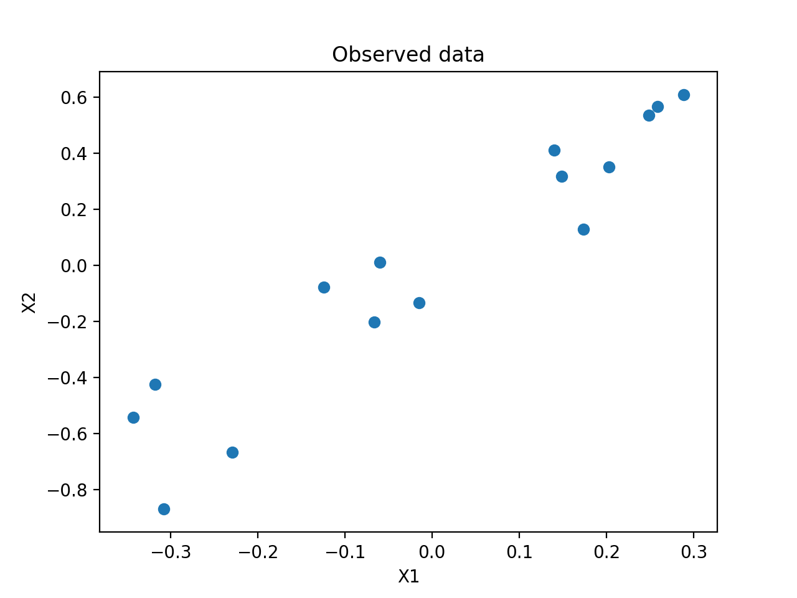
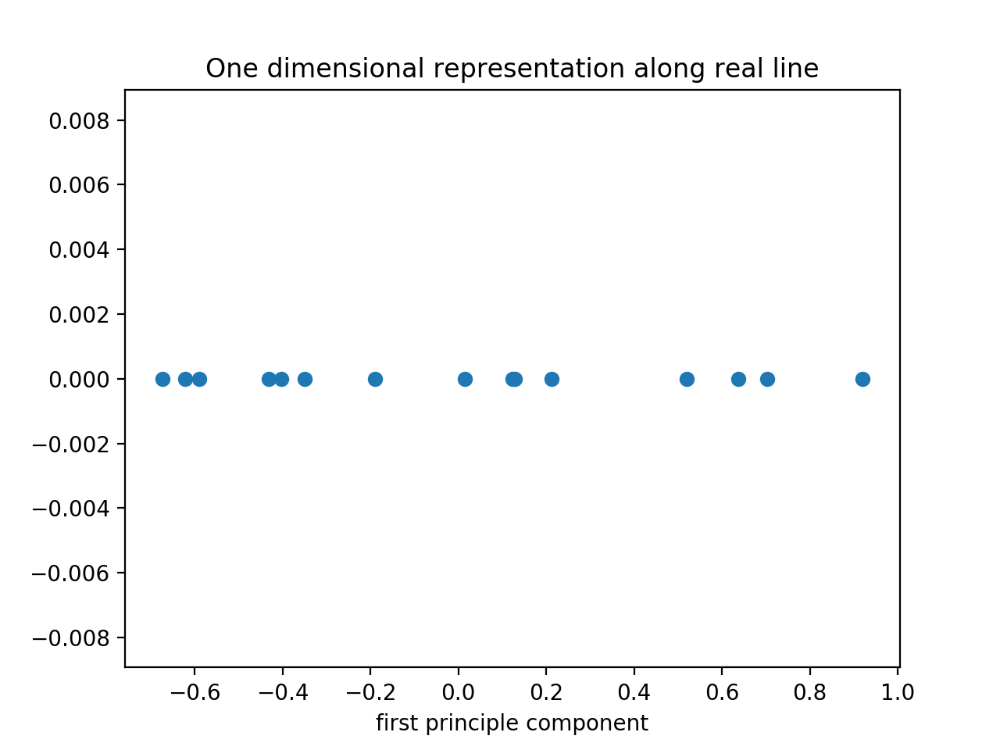
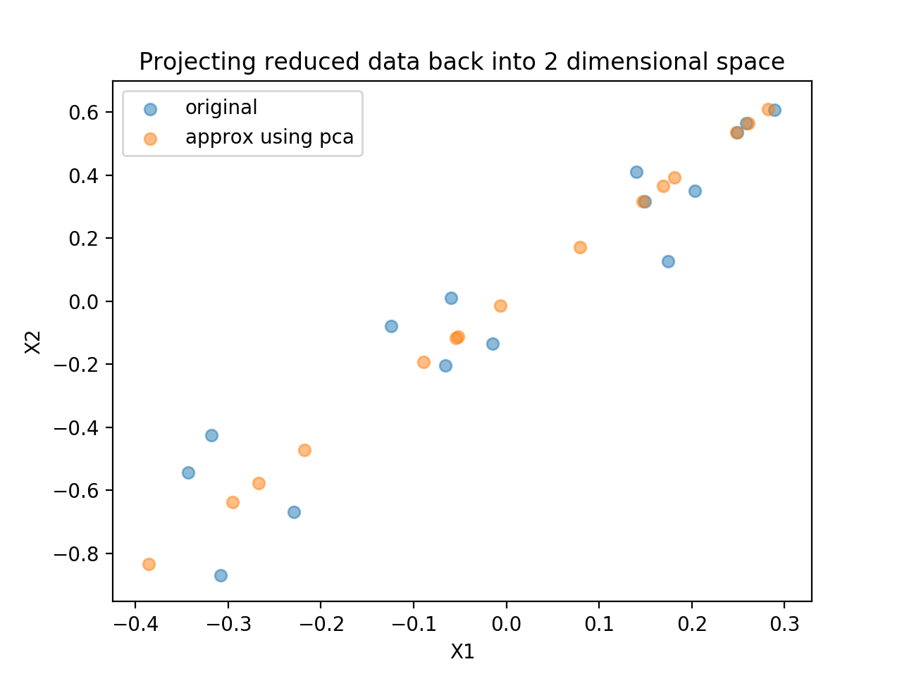

# Principal-Component-Analysis
Explicit example of applying dimensionality reduction to a dataset in 2-dimensional space.

#
#### Python packages used:
- Pandas
- Numpy
- Matplotlib
- Sklearn

#
#### SVD to explore eigenvectors and eigenvalues that make up the dataset
A singular value decomposition is applied to a matrix of observations (2 dimensions) to determine the matrices eigenvectors and eigenvalues.
A singular value decomposition is also applied to the variance-covariance matrix of the matrix of observations to illustrate that the eigenvectors
that capture the variability in the dataset are the same as the eigenvectors that make up the matrix of observations.

#
#### Dimensionality Reduction: R2 -> R1
Having found the eigenvector, **V**, that captures the greatest variability in the dataset, we use this vector as a basis vector for the datset and project all data points onto
this basis vector. Hence, a data point in x-y space can now be explained by the value 'c' such that c**V** is the data point projected onto the basis vector.

#
#### Output images illustrating the dimension reduction:

